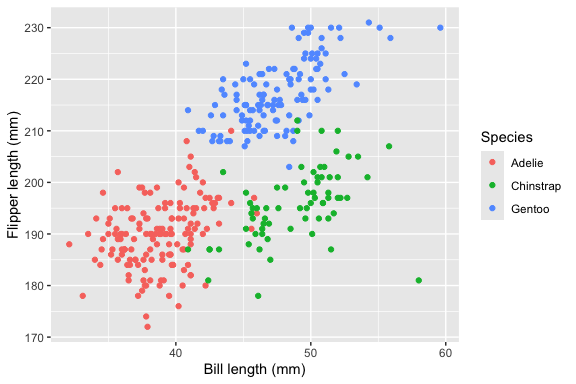

P8105 Homework 1
================
xj2357

# Problem 1

``` r
data("penguins", package = "palmerpenguins")
```

The `penguins` dataset contains body measurements for penguins from the
Palmer Archipelago, Antarctica. It has 344 observations and 8 variables.

The species are Adelie, Chinstrap, and Gentoo, and the islands are
Biscoe, Dream, and Torgersen. Measurements include bill length, bill
depth, and flipper length in millimeters, and body mass in grams. The
dataset also records sex and year.

The mean flipper length is 200.92 mm, excluding missing values.

## Scatterplot

``` r
penguin_plot = ggplot(
  penguins,
  aes(
    x = bill_length_mm,
    y = flipper_length_mm,
    color = species
  )
) +
  geom_point(na.rm = TRUE) +
  labs(
    x = "Bill length (mm)",
    y = "Flipper length (mm)",
    color = "Species"
  )

penguin_plot
```

<!-- -->

Observations with missing bill length or flipper length are omitted from
this plot.

``` r
ggsave(
  filename = "penguin_scatterplot.png",
  plot = penguin_plot,
  width = 6,
  height = 4,
  units = "in",
  dpi = 300
)
```

# Problem 2

## Create the data frame

The data frame below contains a standard normal sample, an indicator of
whether each sampled value is positive, a character vector, and a factor
with three levels.

``` r
set.seed(1)

example_df = tibble(
  normal_sample = rnorm(10),
  is_positive = normal_sample > 0,
  text_value = c("a", "b", "c", "d", "e", "f", "g", "h", "i", "j"),
  category = factor(
    c("A", "B", "C", "A", "B", "C", "A", "B", "C", "A"),
    levels = c("A", "B", "C")
  )
)

example_df
```

    ## # A tibble: 10 × 4
    ##    normal_sample is_positive text_value category
    ##            <dbl> <lgl>       <chr>      <fct>   
    ##  1        -0.626 FALSE       a          A       
    ##  2         0.184 TRUE        b          B       
    ##  3        -0.836 FALSE       c          C       
    ##  4         1.60  TRUE        d          A       
    ##  5         0.330 TRUE        e          B       
    ##  6        -0.820 FALSE       f          C       
    ##  7         0.487 TRUE        g          A       
    ##  8         0.738 TRUE        h          B       
    ##  9         0.576 TRUE        i          C       
    ## 10        -0.305 FALSE       j          A

## Means of different variable types

``` r
mean(pull(example_df, normal_sample))
```

    ## [1] 0.1322028

``` r
mean(pull(example_df, is_positive))
```

    ## [1] 0.6

``` r
mean(pull(example_df, text_value))
```

    ## Warning in mean.default(pull(example_df, text_value)): argument is not numeric
    ## or logical: returning NA

    ## [1] NA

``` r
mean(pull(example_df, category))
```

    ## Warning in mean.default(pull(example_df, category)): argument is not numeric or
    ## logical: returning NA

    ## [1] NA

The numeric and logical variables have valid means. For the logical
variable, TRUE is treated as 1 and FALSE as 0, so its mean is the
proportion of sampled values greater than zero.

The character and factor variables return NA with warnings because these
variables are not numeric or logical.

## Numeric conversion

``` r
as.numeric(pull(example_df, is_positive))
as.numeric(pull(example_df, text_value))
as.numeric(pull(example_df, category))
```

Converting the logical variable to numeric produces 1 for TRUE and 0 for
FALSE. This explains why its mean is the proportion of positive sampled
values.

Converting the character variable produces missing values and a warning,
because the letters cannot be interpreted as numbers.

Converting the factor produces its underlying numeric codes: 1 for A, 2
for B, and 3 for C, according to the specified level order. These codes
identify categories rather than measured quantities. Although their mean
can be computed after conversion, it is not a meaningful average of the
categories. The original factor cannot be passed directly to mean() to
obtain a valid numeric mean.
